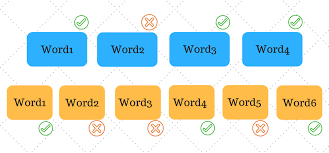

<!-- Add banner here -->

# SENTENCE TO SENTENCE SEMANTIC SIMILARITY
<!-- Add buttons here -->

<!-- Describe your project in brief -->
In this project,  we propose and implement the NLP model to compute the 
semantic similarity between two english sentences/questions using the Support Vector Machine(SVM).

**Full documentation is available inside "/docs" directory.**

# Table of contents
- [Description](#Abstract)
- [Results](#Results)
- [Conclusion](#Conclusion)

## Abstract
There are many methods available to compare words based on the context and the meaning, which convert the word into a representation in an n-dimensional vector space which is referred to as word embedding. Some of the methods are word2vec invented by Tomas Mikolov at Google, Glove from Stanford, and fastTest from Facebook. But, extending the notion of word similarity to complete sentence semantic similarity is one of the toughest problems in the Natural Language Processing(NLP). In this project, we build the system to compute the semantic similarity between two english sentences/questions using the Support Vector Machine(SVM). We consider the multiple similarities like literal similarity, shallow syntactic similarity, and latent semantic similarity as explanatory variables to predict the semantic similarity between two sentences. Our system predicts whether two sentences are duplicate or not based on the intent of the sentences.

## Dataset
We use `Quora Question Pairs` dataset to train our similarity model.

Source: [Quora Dataset](https://www.kaggle.com/c/quora-question-pairs)

## Results

## Conclusion
In this project, we proposed and implemented the NLP model to compute the 
semantic similarity between two english sentences/questions using the Support Vector Machine(SVM).